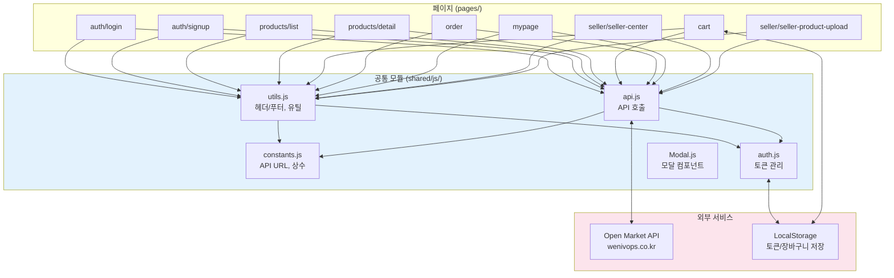

# HODU (호두샵)

<div align="center">


### 판매자와 구매자를 연결하는 오픈마켓 서비스 플랫폼

**"온라인에서 쉽게 팔고, 편하게 사자"**

[](https://developer.mozilla.org/en-US/docs/Web/JavaScript)
[](https://developer.mozilla.org/en-US/docs/Web/HTML)
[](https://developer.mozilla.org/en-US/docs/Web/CSS)

</div>

---

## 프로젝트 소개

> 오픈마켓에서 물건을 사고팔 때 불편하셨던 적 있으신가요?

HODU(호두샵)는 **판매자**와 **구매자**를 위한 직관적인 오픈마켓 서비스입니다.

| 문제 | 해결 |
|------|------|
| 복잡한 상품 등록 과정 | 판매자 센터에서 간편하게 상품 등록/수정/삭제 |
| 불편한 장바구니 관리 | 로컬 장바구니로 빠른 상품 관리 |
| 번거로운 로그인 유지 | JWT 기반 자동 토큰 갱신으로 끊김 없는 경험 |


> *메인 화면 스크린샷을 `docs/visuals/main-screenshot.png`에 저장해주세요*

---

## 배포 링크 / 데모 / Wiki

| 항목 | 링크 |
|------|------|
| 배포 URL | (추후 추가) |
| 데모 영상 | (추후 추가) |
| Wiki | (추후 추가) |
| GitHub | [Team6-ModuLab/OpenMarket-Service](https://github.com/Team6-ModuLab/OpenMarket-Service) |

---

## 팀 소개

<div align="center">

### Team 6 - ModuLab

</div>

<table align="center">
  <tr>
    <td align="center" width="200">
      <a href="https://github.com/Magnesium03">
        <br/>
        <b>팀장 강민기</b>
      </a><br/>
      <sub>Magnesium03</sub><br/>
      <sub>로그인 / 판매자 센터 / 마이페이지 / 주문결제</sub>
    </td>
    <td align="center" width="200">
      <a href="https://github.com/TaeyeongHan2">
        <br/>
        <b>한태영</b>
      </a><br/>
      <sub>TaeyeongHan2</sub><br/>
      <sub>공통 모듈 / 상품 목록 / API 설계</sub>
    </td>
    <td align="center" width="200">
      <a href="https://github.com/hieonjin">
        <br/>
        <b>조현진</b>
      </a><br/>
      <sub>hieonjin</sub><br/>
      <sub>회원가입 / 주문 페이지</sub>
    </td>
    <td align="center" width="200">
      <a href="https://github.com/psw89pxcj8-cyber">
        <br/>
        <b>권하리</b>
      </a><br/>
      <sub>psw89pxcj8-cyber</sub><br/>
      <sub>상품 상세 / 주문 상세</sub>
    </td>
  </tr>
</table>

### 역할 분담 (커밋 분석 기반)

| 팀원 | 커밋 수 | 주요 작업 영역 | 역할 근거 |
|------|---------|---------------|-----------|
| 한태영 | 74 | `shared/js/`, `pages/products/list/`, `pages/cart/` | 공통 유틸/API/인증 모듈 및 상품 목록 페이지 주도 |
| 조현진 | 46 | `pages/auth/signup/`, `pages/order/` | 회원가입 페이지 전체 구현 및 주문 기능 참여 |
| 강민기 | 32 | `pages/seller/`, `pages/auth/login/` | 로그인, 판매자 센터, 상품 등록/수정, 마이페이지, 주문결제 기능 담당 |
| 권하리 | 28 | `pages/products/detail/`, `pages/order/` | 상품 상세 페이지 UI 및 주문 CSS 담당 |

---

## 사용자 시나리오

### 구매자 플로우

1. 상품 목록에서 원하는 상품 검색/탐색
2. 상품 상세 페이지에서 정보 확인
3. 장바구니에 담거나 바로 구매
4. 주문 정보 입력 후 결제 완료
5. 마이페이지에서 주문 내역 확인

### 판매자 플로우

1. 판매자 계정으로 로그인
2. 상품 목록 페이지에서 판매자 센터 버튼 클릭
3. 판매자 센터에서 상품 관리
4. 새 상품 등록 또는 기존 상품 수정/삭제


> *MindMeister에서 유저 시나리오 맵을 PNG로 내보내어 `docs/visuals/mindmeister-user-scenario.png`에 저장*

---

## 화면 설계 (IA/화면 흐름)


### 페이지별 화면

#### 로그인
> 구매자/판매자 로그인 페이지


#### 회원가입
> 구매자/판매자 탭 선택 후 회원가입

| 구매자 회원가입 | 판매자 회원가입 |
|:---:|:---:|
|  |  |

#### 상품 목록 (메인)
> 메인 페이지 - 배너 슬라이더와 전체 상품 목록

| 비로그인 | 구매자 로그인 | 판매자 로그인 |
|:---:|:---:|:---:|
|  |  |  |

#### 상품 검색
> 키워드로 상품 검색


#### 상품 상세
> 상품 정보, 수량 선택, 장바구니/바로구매 버튼


#### 장바구니
> 담은 상품 목록, 수량 조절, 선택 주문


#### 주문/결제
> 배송지 입력, 결제 수단 선택, 최종 결제

| 주문 정보 입력 | 최종 결제 확인 |
|:---:|:---:|
|  |  |

#### 마이페이지
> 주문 내역 목록 조회


#### 주문 상세
> 개별 주문의 상세 정보 확인


#### 판매자 센터
> 등록한 상품 목록 관리


#### 상품 등록/수정
> 상품 정보 및 이미지 등록/수정

| 상품 등록 | 상품 수정 |
|:---:|:---:|
|  |  |

---

## 아키텍처 설계



### 모듈별 책임

| 모듈 | 책임 |
|------|------|
| `constants.js` | API URL, Storage Key, 사용자 타입, 에러 메시지 등 상수 정의 |
| `api.js` | 상품/주문/인증 API 호출 함수 (REST 통신) |
| `auth.js` | JWT 토큰 저장/갱신/삭제, 인증된 fetch 요청 |
| `utils.js` | 동적 헤더/푸터 생성, 경로 계산, 가격 포맷팅 |
| `Modal.js` | 로그인 유도, 삭제 확인 등 재사용 가능한 모달 |

---

## API / 인증 흐름


### 주요 API 엔드포인트

| 기능 | Method | Endpoint |
|------|--------|----------|
| 상품 목록 조회 | GET | `/products/` |
| 상품 상세 조회 | GET | `/products/{id}/` |
| 로그인 | POST | `/accounts/login/` |
| 토큰 갱신 | POST | `/accounts/token/refresh/` |
| 상품 등록 | POST | `/products/` |
| 상품 수정 | PUT | `/products/{id}/` |
| 상품 삭제 | DELETE | `/products/{id}/` |
| 주문 생성 | POST | `/order/` |
| 주문 목록 조회 | GET | `/order/` |

---

## 기술 스택

<div align="center">

| 구분 | 기술 |
|:----:|:----:|
| **Frontend** |    |
| **API 통신** | Fetch API (REST) |
| **인증** | JWT (Access/Refresh Token) |
| **저장소** | LocalStorage |
| **개발 서버** | VS Code Live Server |

</div>

---

## 주요 기능

### 구매자 (Buyer)

| 기능 | 설명 |
|------|------|
| 상품 목록 조회 | 등록된 전체 상품을 목록으로 확인, 배너 슬라이더 |
| 상품 검색 | 키워드로 원하는 상품 검색 |
| 상품 상세 보기 | 상품의 상세 정보, 가격, 재고 확인 |
| 장바구니 | 상품을 담고 수량 조절, 선택 주문 |
| 주문하기 | 단일 상품 또는 장바구니 상품 주문 |
| 마이페이지 | 주문 내역 조회 및 주문 상세 확인 |

### 판매자 (Seller)

| 기능 | 설명 |
|------|------|
| 판매자 센터 | 등록한 상품 목록 관리 |
| 상품 등록 | 새 상품 정보 및 이미지 등록 |
| 상품 수정/삭제 | 기존 상품 정보 수정 및 삭제 |

### 공통

| 기능 | 설명 |
|------|------|
| 회원가입 | 구매자/판매자 유형 선택하여 가입 |
| 로그인/로그아웃 | JWT 기반 인증 (자동 토큰 갱신) |
| 반응형 헤더 | 로그인 상태와 사용자 유형에 따른 동적 메뉴 |

---

## 프로젝트 구조

```
OpenMarket-Service/
├── index.html                          # 진입점 (상품 목록으로 리다이렉트)
│
├── pages/                              # 페이지별 HTML/JS/CSS
│   ├── auth/
│   │   ├── login/                      # 로그인 페이지
│   │   └── signup/                     # 회원가입 페이지
│   ├── products/
│   │   ├── list/                       # 상품 목록 페이지
│   │   └── detail/                     # 상품 상세 페이지
│   ├── cart/                           # 장바구니 페이지
│   ├── order/                          # 주문 페이지
│   ├── mypage/                         # 마이페이지
│   │   └── order-detail/               # 주문 상세 페이지
│   └── seller/
│       ├── seller-center/              # 판매자 센터
│       └── seller-product-upload/      # 상품 등록/수정
│
├── shared/                             # 공통 모듈
│   ├── assets/icons/                   # 아이콘 이미지 (SVG)
│   ├── css/                            # 공통 스타일
│   └── js/
│       ├── constants.js                # 상수 정의
│       ├── api.js                      # API 호출 함수
│       ├── auth.js                     # 인증 서비스
│       ├── utils.js                    # 유틸리티 함수
│       └── components/Modal.js         # 모달 컴포넌트
│
└── docs/                               # 문서 및 이미지
    └── visuals/                        # 발표용 시각 자료
```

---

## 실행 방법

### 1. 저장소 클론

```bash
git clone https://github.com/Team6-ModuLab/OpenMarket-Service.git
cd OpenMarket-Service
```

### 2. 로컬 서버 실행

**VS Code Live Server 사용**
- VS Code에서 프로젝트 열기
- Live Server 확장 설치
- `index.html` 파일 우클릭 → "Open with Live Server"

### 3. 접속

- 브라우저에서 `http://localhost:5500` 접속
- 자동으로 상품 목록 페이지로 이동

---

## 프로젝트 일정 / 진행 과정

> 개발 기간: 2026.01.12 ~ 2026.01.17 (6일)


### 주차별 마일스톤

| 일자 | 커밋 수 | 주요 작업 |
|------|---------|----------|
| 1/12~13 | 28 | 프로젝트 초기 세팅, 폴더 구조 설계, 기본 UI 골격 |
| 1/14 | 38 | 상품 목록/상세, 회원가입, 로그인 페이지 UI 구현 |
| 1/15 | 29 | API 연동, 장바구니, 주문 기능 구현 |
| 1/16 | 76 | Access Token 자동 갱신, 코드 리팩토링, 버그 수정, 판매자 기능 완성 |
| 1/17 | 9 | 최종 정리, 불필요 파일 제거, README 작성 |

---

## 트러블슈팅 / 회고

### 1. Access Token 자동 갱신 이슈
- **문제**: 토큰 만료 시 여러 API 요청이 동시에 refresh를 시도하여 충돌
- **해결**: `isRefreshing` 플래그와 `refreshQueue`로 동시 갱신 방지 및 대기 큐 구현

### 2. 이벤트 리스너 중복 등록
- **문제**: 드롭다운 메뉴 이벤트가 페이지 이동 시 중복 등록
- **해결**: `isDropdownClickListenerRegistered` 플래그로 전역 리스너 중복 방지

### 3. 경로 계산 복잡성
- **문제**: 페이지 깊이에 따라 상대 경로가 달라져 리소스 로딩 실패
- **해결**: `getPagesBasePath()`, `getSharedBasePath()` 함수로 동적 경로 계산

### 4. 판매자/구매자 UI 분기
- **문제**: 같은 헤더에서 사용자 타입별로 다른 메뉴 표시 필요
- **해결**: `USER_TYPES` 상수와 `updateHeader()` 함수로 동적 메뉴 생성

---

## 브랜치 전략

- `main`: 프로덕션 배포용
- `dev`: 개발 통합 브랜치
- `feat/*`: 기능 개발 브랜치
- `refactor/*`: 리팩토링 브랜치
- `fix/*`: 버그 수정 브랜치

---

## 시연 영상


> *주요 기능 시연 GIF를 `docs/visuals/demo.gif`에 저장*

---

## Mermaid 다이어그램 목록

| 다이어그램 | 유형 | 설명 |
|-----------|------|------|
| 화면 설계 (IA) | flowchart | 페이지 간 이동 흐름 |
| 아키텍처 설계 | flowchart | 모듈 간 의존/데이터 흐름 |
| API/인증 흐름 | sequenceDiagram | 토큰 갱신 및 인증 시퀀스 |
| 프로젝트 타임라인 | gantt | 일자별 개발 진행 현황 |

---

<div align="center">

Made with by **Team 6 - ModuLab**

</div>
