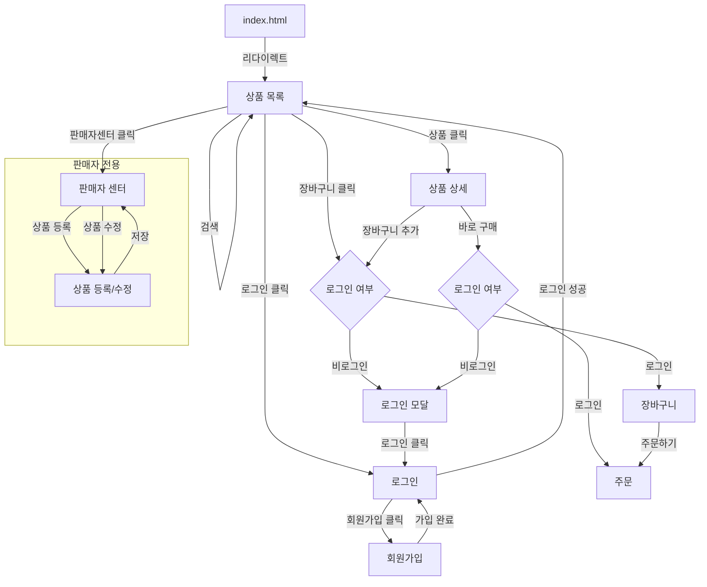
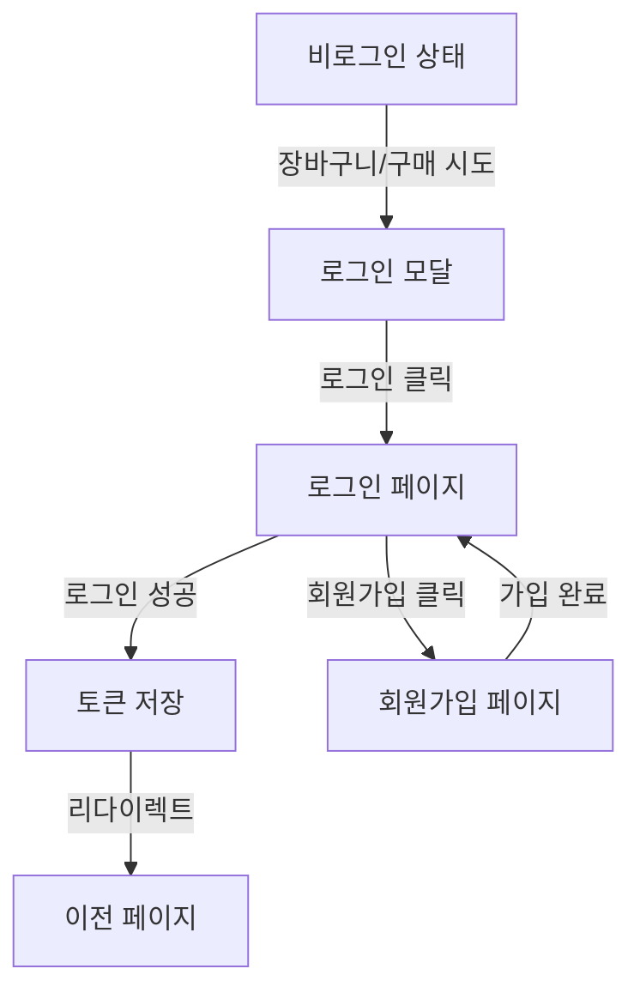

# 04. PagesAndRouting - 페이지 및 라우팅

## 페이지별 상세 정보

### 상품 목록 페이지

| 항목 | 값 |
|------|-----|
| URL | `/pages/products/list/` |
| 진입 파일 | `pages/products/list/index.html` |
| JavaScript | `pages/products/list/product-list.js` |
| CSS | `pages/products/list/product-list.css` |
| 인증 필요 | 아니오 |
| 쿼리스트링 | `?search={검색어}` (선택) |

**기능**: 배너 슬라이더, 상품 그리드, 검색

### 상품 상세 페이지

| 항목 | 값 |
|------|-----|
| URL | `/pages/products/detail/` |
| 진입 파일 | `pages/products/detail/index.html` |
| JavaScript | `pages/products/detail/product-detail.js` |
| CSS | `pages/products/detail/product-detail.css` |
| 인증 필요 | 아니오 (장바구니 추가 시 필요) |
| 쿼리스트링 | `?id={상품ID}` (필수) |

**기능**: 상품 정보 표시, 수량 선택, 장바구니 추가, 바로 구매

### 장바구니 페이지

| 항목 | 값 |
|------|-----|
| URL | `/pages/cart/` |
| 진입 파일 | `pages/cart/index.html` |
| JavaScript | `pages/cart/cart.js` |
| CSS | `pages/cart/cart.css` |
| 인증 필요 | 예 (비로그인 시 모달) |
| 쿼리스트링 | 없음 |

**기능**: 장바구니 아이템 관리, 수량 조절, 주문하기

### 주문 페이지

| 항목 | 값 |
|------|-----|
| URL | `/pages/order/` |
| 진입 파일 | `pages/order/index.html` |
| JavaScript | `pages/order/order.js` |
| CSS | `pages/order/order.css` |
| 인증 필요 | 예 |
| 쿼리스트링 | 없음 |

**기능**: 주문 정보 확인, 결제

### 로그인 페이지

| 항목 | 값 |
|------|-----|
| URL | `/pages/auth/login/` |
| 진입 파일 | `pages/auth/login/index.html` |
| JavaScript | `pages/auth/login/login.js` |
| CSS | `pages/auth/login/login.css` |
| 인증 필요 | 아니오 |
| 쿼리스트링 | 없음 |

**기능**: 사용자 인증, 토큰 발급

### 회원가입 페이지

| 항목 | 값 |
|------|-----|
| URL | `/pages/auth/signup/` |
| 진입 파일 | `pages/auth/signup/index.html` |
| JavaScript | `pages/auth/signup/signup.js` |
| CSS | `pages/auth/signup/signup.css` |
| 인증 필요 | 아니오 |
| 쿼리스트링 | 없음 |

**기능**: 구매자/판매자 회원가입, ID 중복검사, 유효성 검증

### 판매자 센터 페이지

| 항목 | 값 |
|------|-----|
| URL | `/pages/seller/seller-center/` |
| 진입 파일 | `pages/seller/seller-center/index.html` |
| JavaScript | `pages/seller/seller-center/seller-center.js` |
| CSS | `pages/seller/seller-center/seller-center.css` |
| 인증 필요 | 예 (SELLER만) |
| 쿼리스트링 | 없음 |

**기능**: 판매자 상품 목록, 수정/삭제

### 상품 등록/수정 페이지

| 항목 | 값 |
|------|-----|
| URL | `/pages/seller/seller-product-upload/` |
| 진입 파일 | `pages/seller/seller-product-upload/index.html` |
| JavaScript | `pages/seller/seller-product-upload/seller-product-upload.js` |
| CSS | `pages/seller/seller-product-upload/seller-product-upload.css` |
| 인증 필요 | 예 (SELLER만) |
| 쿼리스트링 | `?id={상품ID}` (수정 시) |

**기능**: 상품 등록, 상품 수정

## 공통 레이아웃

### 헤더 구조

모든 페이지에 공통 헤더가 포함됩니다.

```html
<header id="header">
    <div class="header-container">
        <h1 class="logo">
            <a href="{상대경로}/products/list/index.html">
                
            </a>
        </h1>
        <form class="search-bar">
            <input type="text" placeholder="상품을 검색해보세요!">
            <button type="submit">검색</button>
        </form>
        <nav class="user-menu">
            <!-- 동적 생성: 로그인 상태에 따라 변경 -->
        </nav>
    </div>
</header>
```

**동적 메뉴 (로그인 상태에 따라)**:
- **비로그인**: 장바구니(모달), 로그인
- **구매자(BUYER)**: 장바구니, 마이페이지
- **판매자(SELLER)**: 마이페이지, 판매자센터

### 푸터 구조

```html
<footer id="footer">
    <div class="footer-links">
        <a href="#">호두샵 소개</a>
        <a href="#">이용약관</a>
        <a href="#">개인정보처리방침</a>
        <a href="#">고객센터</a>
    </div>
    <div class="footer-info">
        <p>© HODU. All rights reserved.</p>
    </div>
</footer>
```

## 페이지 연결 방식

### 링크 기반 네비게이션

페이지 간 이동은 `<a>` 태그를 사용한 링크 방식입니다.

```javascript
// 상대 경로 계산 함수 (shared/js/utils.js)
function getPagesBasePath() {
    const path = window.location.pathname;
    const match = path.match(/\/pages\/(.+)/);
    if (match) {
        const afterPages = match[1];
        const parts = afterPages.split('/');
        const folderCount = parts.length - 1;
        return '../'.repeat(folderCount);
    }
    return './';
}
```

### 쿼리스트링 활용

```javascript
// 상품 상세로 이동 (상품 ID 전달)
window.location.href = `../detail/index.html?id=${productId}`;

// 상품 ID 읽기
const params = new URLSearchParams(window.location.search);
const productId = params.get('id');

// 검색 결과 페이지
window.location.href = `./index.html?search=${encodeURIComponent(query)}`;
```

### JavaScript 리다이렉트

```javascript
// 로그인 성공 후
window.location.href = '/pages/products/list/';

// 비로그인 접근 차단
if (!token) {
    showLoginModal();
}
```

## 페이지 이동 흐름 (Mermaid 다이어그램)

### 전체 페이지 흐름



### 구매 흐름


### 인증 흐름



## 데이터 전달 방식

### localStorage 활용

| 키 | 용도 | 생성 페이지 | 사용 페이지 |
|----|------|-----------|-----------|
| `access` | API 인증 토큰 | 로그인 | 모든 페이지 |
| `refresh` | 토큰 갱신 | 로그인 | API 호출 시 |
| `userType` | 사용자 유형 | 로그인 | 헤더 메뉴 |
| `cart` | 장바구니 데이터 | 상품 상세 | 장바구니 |
| `order_data` | 주문 데이터 | 장바구니 | 주문 |

### 쿼리스트링 활용

| 파라미터 | 용도 | 사용 페이지 |
|---------|------|-----------|
| `id` | 상품 ID | 상품 상세, 상품 수정 |
| `search` | 검색어 | 상품 목록 |

---

## 관련 파일/경로

| 항목 | 경로 |
|------|------|
| 진입점 | `index.html` |
| 공용 헤더/푸터 스타일 | `shared/css/common.css` |
| 경로 계산 유틸 | `shared/js/utils.js` |
| 헤더 업데이트 로직 | `shared/js/utils.js` → `updateHeader()` |
