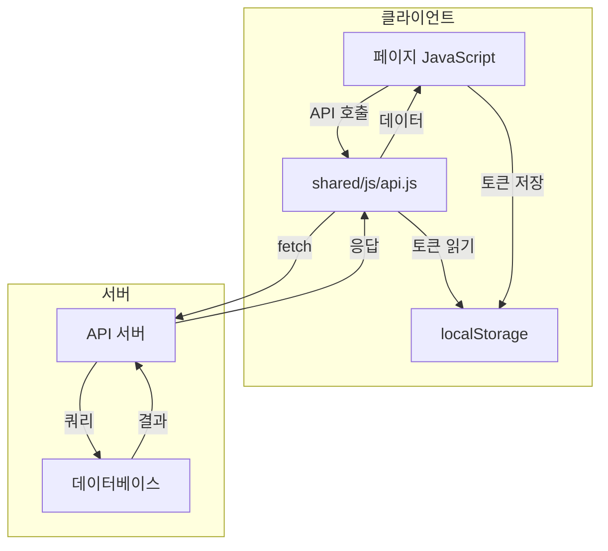

# 05. API Integration - API 연동

## API 기본 정보

### Base URL

```javascript
// shared/js/api.js에 정의
const API_BASE_URL = 'https://api.wenivops.co.kr/services/open-market';
```

> **주의**: `.env` 파일에 `VITE_API_BASE_URL=https://openmarket.weniv.co.kr`가 있지만, 실제 코드에서는 사용되지 않습니다.

### 인증 방식

**Bearer Token 인증**

```javascript
headers: {
    'Authorization': `Bearer ${localStorage.getItem('access')}`
}
```

## API 엔드포인트 목록

### 인증 관련

| 메서드 | 엔드포인트 | 용도 | 인증 | 구현 위치 |
|--------|-----------|------|------|----------|
| POST | `/accounts/login/` | 로그인 | 불필요 | `api.js:34` |
| POST | `/accounts/validate-username/` | ID 중복 검사 | 불필요 | `signup.js:87` |

### 상품 관련

| 메서드 | 엔드포인트 | 용도 | 인증 | 구현 위치 |
|--------|-----------|------|------|----------|
| GET | `/products/` | 전체 상품 조회 | 불필요 | `api.js:6` |
| GET | `/products/{id}/` | 상품 상세 조회 | 불필요 | `api.js:21` |
| GET | `/{sellerName}/products/` | 판매자 상품 조회 | 필요 | `api.js:57` |
| POST | `/products/` | 상품 생성 | 필요 | `api.js:80` |
| PUT | `/products/{id}/` | 상품 수정 | 필요 | `api.js:106` |
| DELETE | `/products/{id}/` | 상품 삭제 | 필요 | `api.js:129` |

### 주문 관련

| 메서드 | 엔드포인트 | 용도 | 인증 | 구현 위치 |
|--------|-----------|------|------|----------|
| POST | `/order/` | 주문 생성 | 필요 | `api.js:155` |
| GET | `/order/` | 주문 목록 조회 | 필요 | `api.js:181` |
| GET | `/order/{id}/` | 주문 상세 조회 | 필요 | `api.js:201` |
| DELETE | `/order/{id}/` | 주문 취소 | 필요 | `api.js:221` |

## API 모듈 상세 (shared/js/api.js)

### API 객체 구조

```javascript
const API = {
    // 상품 조회
    async getProducts(searchQuery = '') { ... },
    async getProduct(productId) { ... },

    // 인증
    async login(username, password, userType) { ... },

    // 판매자 상품
    async getSellerProducts(sellerName) { ... },
    async createProduct(productData) { ... },
    async updateProduct(productId, productData) { ... },
    async deleteProduct(productId) { ... },

    // 주문
    async createOrder(orderData) { ... },
    async getOrders() { ... },
    async getOrder(orderId) { ... },
    async deleteOrder(orderId) { ... }
};

// 전역으로 노출
window.API = API;
```

### 사용 예시

```javascript
// 상품 목록 조회
const products = await API.getProducts();

// 검색
const searchResults = await API.getProducts('키워드');

// 상품 상세 조회
const product = await API.getProduct(123);

// 로그인
const result = await API.login('username', 'password', 'BUYER');

// 판매자 상품 조회
const sellerProducts = await API.getSellerProducts('sellerName');

// 상품 생성 (FormData)
const formData = new FormData();
formData.append('product_name', '상품명');
formData.append('price', 10000);
const newProduct = await API.createProduct(formData);
```

## 요청/응답 처리

### 상품 목록 조회

```javascript
// 요청
GET /products/?search={검색어}

// 응답
{
    "count": 100,
    "next": "https://api.../products/?page=2",
    "previous": null,
    "results": [
        {
            "product_id": 1,
            "product_name": "상품명",
            "price": 10000,
            "image": "https://...",
            "seller_store": "판매자"
        },
        ...
    ]
}
```

### 로그인

```javascript
// 요청
POST /accounts/login/
Content-Type: application/json

{
    "username": "사용자ID",
    "password": "비밀번호",
    "login_type": "BUYER" // 또는 "SELLER"
}

// 응답 (성공)
{
    "access": "eyJ...",
    "refresh": "eyJ...",
    "user": {
        "username": "사용자ID",
        "user_type": "BUYER",
        "name": "사용자명"
    }
}
```

### ID 중복 검사

```javascript
// 요청
POST /accounts/validate-username/
Content-Type: application/json

{
    "username": "검사할ID"
}

// 응답 (사용 가능)
{
    "message": "사용 가능한 아이디입니다."
}

// 응답 (중복)
{
    "message": "이미 사용 중인 아이디입니다."
}
```

## 에러 처리

### 공통 에러 처리 패턴

```javascript
try {
    const response = await fetch(url, options);

    if (!response.ok) {
        throw new Error(`HTTP ${response.status}`);
    }

    const data = await response.json();
    return data;
} catch (error) {
    console.error('API 호출 실패:', error);
    throw error;
}
```

### 에러 유형

| 상태 코드 | 의미 | 처리 방법 |
|----------|------|---------|
| 400 | 잘못된 요청 | 입력값 확인 |
| 401 | 인증 실패 | 로그인 필요 |
| 403 | 권한 없음 | 권한 확인 |
| 404 | 리소스 없음 | 상품 없음 처리 |
| 500 | 서버 오류 | 재시도 또는 오류 메시지 |

## Pagination 처리

### 응답 구조

```javascript
{
    "count": 100,        // 전체 개수
    "next": "...",       // 다음 페이지 URL
    "previous": "...",   // 이전 페이지 URL
    "results": [...]     // 현재 페이지 데이터
}
```

### 현재 구현 상태

현재 프로젝트에서는 pagination을 사용하지 않고, 첫 페이지 결과만 렌더링합니다.

> **TODO(확인 필요)**: pagination 구현 여부

## 데이터 흐름 다이어그램



## 직접 API 호출 위치

일부 파일에서는 `api.js`를 사용하지 않고 직접 fetch를 호출합니다.

| 파일 | 직접 호출 엔드포인트 |
|------|---------------------|
| `product-detail.js` | `/products/{id}/` |
| `product-list.js` | `/products/?search=` |
| `signup.js` | `/accounts/validate-username/` |

> **개선 권장**: 모든 API 호출을 `api.js` 모듈로 통일

## 토큰 관리

### 저장 위치

```javascript
localStorage.setItem('access', result.access);
localStorage.setItem('refresh', result.refresh);
localStorage.setItem('userType', result.user.user_type);
```

### 토큰 사용

```javascript
const token = localStorage.getItem('access');

headers: {
    'Authorization': `Bearer ${token}`
}
```

### 로그아웃

```javascript
localStorage.removeItem('access');
localStorage.removeItem('refresh');
localStorage.removeItem('userType');
```

---

## 관련 파일/경로

| 항목 | 경로 |
|------|------|
| API 모듈 | `shared/js/api.js` |
| 로그인 | `pages/auth/login/login.js` |
| 회원가입 | `pages/auth/signup/signup.js` |
| 상품 목록 | `pages/products/list/product-list.js` |
| 상품 상세 | `pages/products/detail/product-detail.js` |
| 판매자 센터 | `pages/seller/seller-center/seller-center.js` |
