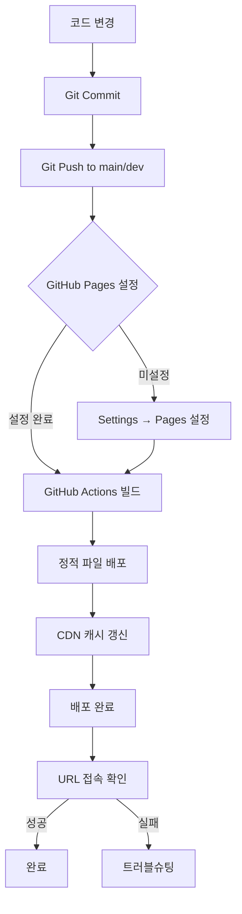

# 07. Deployment - GitHub Pages 배포

## 배포 구조 개요

### 현재 상태

| 항목 | 상태 |
|------|------|
| 빌드 도구 | 없음 (정적 파일) |
| 빌드 산출물 | 없음 (dist 폴더 미존재) |
| GitHub Pages | TODO(확인 필요) |
| Base 경로 | `/` (루트) |

### 파일 구조

```
OpenMarket-Service/
├── index.html              # 진입점 → 리다이렉트
├── pages/                  # 페이지 HTML/CSS/JS
├── shared/                 # 공용 리소스
└── (배포 시 전체 복사)
```

## 진입점 리다이렉트

### index.html

```html
<!DOCTYPE html>
<html>
<head>
    <meta http-equiv="refresh" content="0; url=./pages/products/list/index.html">
</head>
<body>
    <p>리다이렉트 중...</p>
</body>
</html>
```

- 루트 접속 시 `/pages/products/list/index.html`로 자동 이동
- HTTP meta refresh 방식 사용

## GitHub Pages 설정 방법

### 1단계: 레포지토리 Settings

1. GitHub 레포지토리 페이지 접속
2. Settings 탭 클릭
3. 좌측 메뉴에서 "Pages" 선택

### 2단계: 소스 설정

| 설정 항목 | 권장 값 |
|----------|--------|
| Source | Deploy from a branch |
| Branch | `main` 또는 `dev` |
| Folder | `/ (root)` |

### 3단계: 저장 및 확인

1. "Save" 클릭
2. 배포 완료까지 1-2분 대기
3. 상단에 표시되는 URL로 접속

## Assets 경로 처리

### 상대 경로 사용

모든 리소스는 상대 경로로 참조합니다.

```html
<!-- pages/products/list/index.html -->
<link rel="stylesheet" href="../../../shared/css/reset.css">
<link rel="stylesheet" href="../../../shared/css/common.css">
<script src="../../../shared/js/api.js"></script>
```

### 동적 경로 계산

```javascript
// shared/js/utils.js
function getPagesBasePath() {
    const path = window.location.pathname;
    const match = path.match(/\/pages\/(.+)/);
    if (match) {
        const afterPages = match[1];
        const parts = afterPages.split('/');
        const folderCount = parts.length - 1;
        return '../'.repeat(folderCount);
    }
    return './';
}

// 사용 예
const basePath = getPagesBasePath();
const logoUrl = basePath + '../shared/assets/icons/Logo-hodu.png';
```

## 404 처리

### GitHub Pages 기본 동작

GitHub Pages는 존재하지 않는 경로 접속 시 `404.html`을 표시합니다.

### 현재 상태

> **TODO(확인 필요)**: `404.html` 파일이 프로젝트에 존재하지 않습니다.

### 권장 설정

```html
<!-- 404.html (루트에 생성) -->
<!DOCTYPE html>
<html>
<head>
    <meta charset="UTF-8">
    <title>페이지를 찾을 수 없습니다</title>
    <meta http-equiv="refresh" content="3; url=./pages/products/list/index.html">
</head>
<body>
    <h1>404 - 페이지를 찾을 수 없습니다</h1>
    <p>3초 후 메인 페이지로 이동합니다...</p>
    <a href="./pages/products/list/index.html">메인으로 이동</a>
</body>
</html>
```

## 배포 흐름 다이어그램



## 알려진 이슈

### API Timeout 문제

**증상**: 배포 환경에서 API 호출 시 응답 지연 또는 실패

**원인 후보**:
1. CORS 설정 문제
2. API 서버 응답 지연
3. 네트워크 불안정

**확인 방법**:
```javascript
// 브라우저 개발자 도구 Console에서
fetch('https://api.wenivops.co.kr/services/open-market/products/')
    .then(res => console.log('성공:', res.status))
    .catch(err => console.error('실패:', err));
```

### 가로 스크롤 문제

**증상**: 특정 페이지에서 가로 스크롤 발생

**원인**: 배너 슬라이더 transform 계산 오류

**관련 파일**:
- `pages/products/list/product-list.js`
- `product_list_banner.md` (버그 리포트)

## 배포 확인 체크리스트

### 배포 전

- [ ] 모든 변경사항 commit 완료
- [ ] `main` 또는 `dev` 브랜치에 push
- [ ] GitHub Pages 설정 확인

### 배포 후

- [ ] 메인 페이지 접속 확인
- [ ] 상품 목록 API 호출 확인
- [ ] 이미지/아이콘 로드 확인
- [ ] 페이지 간 네비게이션 확인
- [ ] 로그인 기능 확인
- [ ] 장바구니 기능 확인
- [ ] 콘솔 에러 없음 확인

### 롤백 방법

문제 발생 시:
1. 이전 커밋으로 revert
2. main/dev 브랜치에 push
3. GitHub Pages 자동 재배포 대기

```bash
# 최근 커밋 취소
git revert HEAD
git push origin main
```

## 환경별 API URL

| 환경 | URL | 비고 |
|------|-----|------|
| 개발 (로컬) | `https://api.wenivops.co.kr/services/open-market` | 현재 사용 |
| 프로덕션 | 동일 | TODO(확인 필요) |

> **참고**: `.env` 파일의 `VITE_API_BASE_URL`은 실제 사용되지 않습니다.

---

## 관련 파일/경로

| 항목 | 경로 |
|------|------|
| 진입점 | `index.html` |
| 경로 유틸 | `shared/js/utils.js` |
| 배너 버그 리포트 | `product_list_banner.md` |
| Git 설정 | `.git/` |
