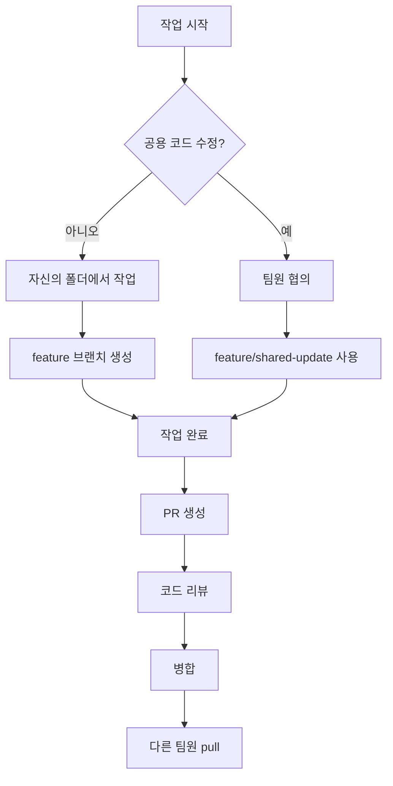

# 08. Contributing - 기여 가이드

## 브랜치 전략

### 브랜치 구조

```
main                    # 프로덕션 브랜치
  └── dev               # 개발 브랜치 (기본)
       ├── feat/*       # 기능 개발
       ├── fix/*        # 버그 수정
       └── feature/shared-update  # 공용 코드 수정
```

### 현재 브랜치 (git branch -a)

```
* dev                          # 현재 활성 브랜치
  feat/product-list-banner-peek
  fix/cart-navigation-path

  remotes/origin/dev
  remotes/origin/main
  remotes/origin/feat/*
  remotes/origin/fix/*
```

### 브랜치 명명 규칙

| 타입 | 형식 | 예시 |
|------|------|------|
| 기능 개발 | `feat/{기능명}` | `feat/product-list` |
| 버그 수정 | `fix/{버그명}` | `fix/cart-navigation-path` |
| 공용 코드 | `feature/shared-update` | - |

## PR(Pull Request) 규칙

### 기본 정책

1. `main`/`dev` 브랜치에 직접 push 금지
2. 모든 변경은 PR을 통해 병합
3. 코드 리뷰 후 병합

### PR 생성 절차

1. feature 브랜치에서 작업 완료
2. GitHub에서 PR 생성
3. 팀원 리뷰 요청
4. 리뷰 반영 후 병합

### PR 템플릿 (권장)

```markdown
## 작업 내용
- 변경 사항 요약

## 관련 이슈
- #이슈번호

## 테스트 방법
- 테스트 절차

## 스크린샷
- (UI 변경 시)

## 체크리스트
- [ ] 로컬 테스트 완료
- [ ] 코드 컨벤션 준수
- [ ] 충돌 해결 완료
```

## 커밋 컨벤션

### 커밋 메시지 형식

```
[작업영역] 작업 내용
```

또는

```
type: 작업 내용
```

### 작업 영역 예시

| 영역 | 담당 폴더 |
|------|----------|
| `[Login]` | `pages/auth/login/` |
| `[Signup]` | `pages/auth/signup/` |
| `[ProductList]` | `pages/products/list/` |
| `[ProductDetail]` | `pages/products/detail/` |
| `[Cart]` | `pages/cart/` |
| `[Order]` | `pages/order/` |
| `[Seller]` | `pages/seller/` |
| `[Shared]` | `shared/` |

### 타입 프리픽스

| 타입 | 설명 |
|------|------|
| `feat:` | 새로운 기능 |
| `fix:` | 버그 수정 |
| `style:` | 스타일 변경 (기능 변경 없음) |
| `refactor:` | 코드 리팩토링 |
| `docs:` | 문서 변경 |
| `chore:` | 빌드, 설정 변경 |

### 예시

```
[Login] 로그인 폼 UI 구현
[Signup] 비밀번호 유효성 검사 추가
[ProductList] 상품 목록 API 연동
[ProductDetail] 상품 상세 정보 표시
[Shared] API 유틸리티 함수 추가

feat: 배너 슬라이더 추가
fix: 장바구니 경로 오류 수정
style: 화살표 버튼 위치 조정
```

## 작업 영역 분리 (충돌 방지)

### 팀원별 담당 영역

| 팀원 | 담당 폴더 | 브랜치 |
|------|----------|--------|
| 팀원 1 | `pages/auth/login/` | `feature/login` |
| 팀원 2 | `pages/auth/signup/` | `feature/signup` |
| 팀원 3 | `pages/products/list/` | `feature/product-list` |
| 팀원 4 | `pages/products/detail/` | `feature/product-detail` |

### 공용 코드 수정 시

1. 팀원 사전 협의 필수
2. `feature/shared-update` 브랜치에서 작업
3. PR 생성 및 리뷰
4. 병합 후 각자 브랜치에서 pull

### 충돌 방지 가이드



## 코드 스타일 가이드

### JavaScript

```javascript
// 변수명: camelCase
const productList = [];
const isLoggedIn = true;

// 함수명: camelCase, 동사로 시작
function getProducts() { }
function renderProductList() { }
function handleClick() { }

// 상수: UPPER_SNAKE_CASE
const API_BASE_URL = 'https://...';
const AUTO_PLAY_DELAY = 4000;

// 이벤트 핸들러: handle + 이벤트명
function handleSubmit(e) { }
function handleClick(e) { }
```

### CSS

```css
/* 클래스명: kebab-case */
.product-card { }
.banner-section { }
.btn-primary { }

/* BEM 유사 패턴 */
.product-card { }          /* Block */
.product-card__image { }   /* Element */
.product-card--featured { } /* Modifier */
```

### 파일명

```
pages/{카테고리}/{페이지명}/
├── index.html
├── {페이지명}.js          # kebab-case
└── {페이지명}.css         # kebab-case
```

## 작업 흐름

### 1. 브랜치 생성

```bash
# dev에서 최신 코드 가져오기
git checkout dev
git pull origin dev

# feature 브랜치 생성
git checkout -b feat/my-feature
```

### 2. 작업 및 커밋

```bash
# 변경사항 확인
git status

# 스테이징
git add .

# 커밋
git commit -m "[영역] 작업 내용"
```

### 3. PR 생성

```bash
# 원격에 push
git push origin feat/my-feature

# GitHub에서 PR 생성
```

### 4. 병합 후 정리

```bash
# dev 최신화
git checkout dev
git pull origin dev

# 로컬 브랜치 삭제
git branch -d feat/my-feature
```

## 리뷰 체크리스트

- [ ] 코드가 의도한 대로 동작하는가?
- [ ] 기존 기능에 영향을 주지 않는가?
- [ ] 코드 스타일 가이드를 준수했는가?
- [ ] 불필요한 console.log가 없는가?
- [ ] 하드코딩된 값이 없는가?
- [ ] 주석이 필요한 복잡한 로직에 주석이 있는가?

---

## 관련 파일/경로

| 항목 | 경로 |
|------|------|
| 프로젝트 README | `README.md` |
| Git 설정 | `.git/` |
| 공용 코드 | `shared/` |
